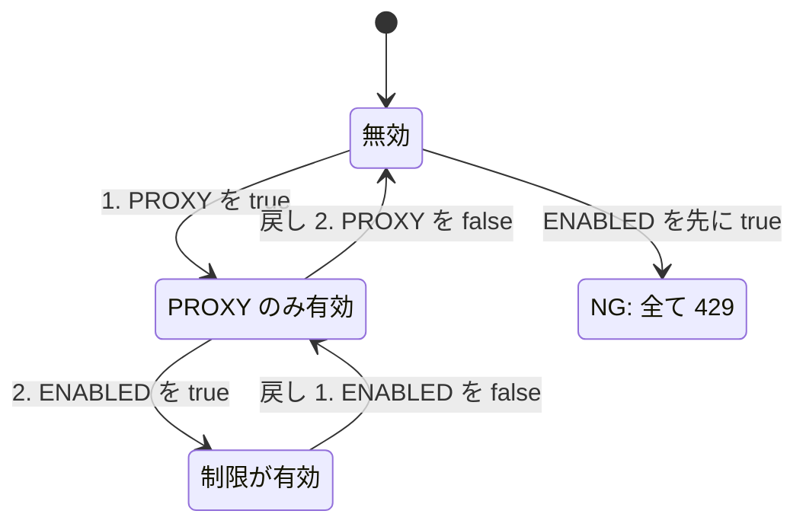
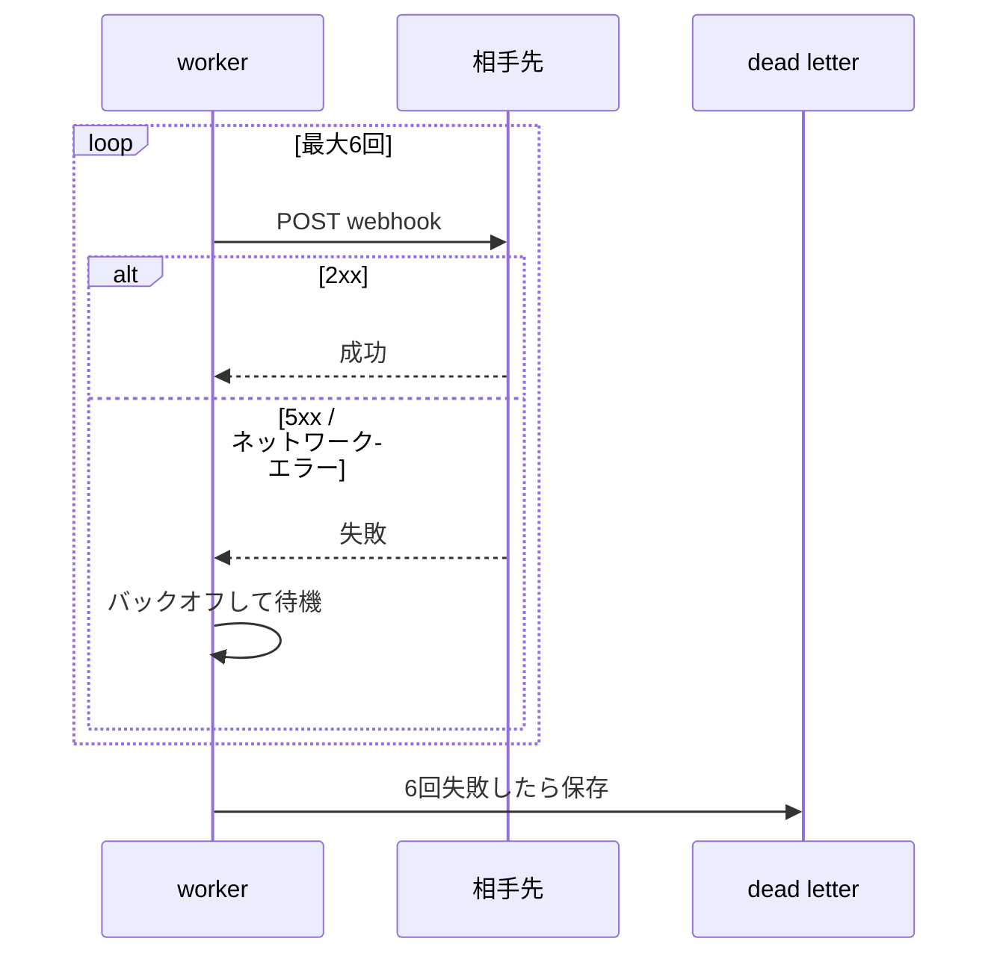

# write-pr-description (PR description の執筆)

PR description の読み手は、他の作業の合間に来たレビュアー。
レビュアーが知りたいのは次の3つだけ。

| 知りたいこと | 例 |
|---|---|
| 何が変わるのか | 公開 API にレート制限を追加 |
| なぜその変え方なのか | クローラーによる DB 高負荷 (INC-311) |
| どこを注意して見ればよいか | `X-Forwarded-For` の扱い |

1文に情報を詰め込むと、読み手は頭の中で文を分解し直すことになる。
その分解のコストが積み重なると、長い description は読み飛ばされる。
構成はテンプレートに任せ、文の形と表で読みやすさを確保するのがこのスキルの役割。

## 手順

### 1. 材料を集める

- ベースブランチを特定(`gh repo view --json defaultBranchRef` か、ユーザーの指定)
- `git log <base>..HEAD --oneline` と `git diff <base>...HEAD --stat` で全体像を把握
- 必要な箇所だけ `git diff <base>...HEAD -- <path>` で中身を読む
- ブランチ名やコミットメッセージから、関連 issue / チケット番号を拾う
- 既存 PR を直す場合は現在の本文を読む(GitHub MCP の `pull_request_read`、なければ `gh pr view --json title,body`)

差分から読み取れない「なぜ」は、会話の文脈から拾う。
それでも分からなければ、推測で書かずにユーザーに聞く。
動機を捏造した description は、無いよりも悪い。

### 2. テンプレートを探す

次の順に探し、最初に見つかったものを使う。

1. `.github/pull_request_template.md`
2. `.github/PULL_REQUEST_TEMPLATE/` 配下(複数あれば変更内容に合うもの)
3. `pull_request_template.md` / `docs/pull_request_template.md`

テンプレートがある場合の扱い:

| 要素 | 扱い |
|---|---|
| 見出し | 名前と順番を変えない |
| チェックリスト | 残す。実施したものだけ `[x]` |
| HTML コメントの記入指示 | 指示に従って書いたうえで削除 |
| 該当しない見出し | 消さずに「なし」 |

テンプレートがない場合は次の構成。

```markdown
## 概要
## 変更内容
## 確認したこと
## 関連
```

### 3. 書く

後述の「書き方のルール」に従う。
まず「概要」を書き、そこだけでレビュアーが全体を判断できる状態にする。

### 4. 見直す

「見直しチェックリスト」を上から順に当てる。
引っかかった文は、言い換えではなく分割・表への移動・削除で直す。

### 5. 作成・更新する

PR の作成と更新は外部に公開される操作。
ユーザーが作成・更新まで明示的に依頼していなければ、下書きを見せて確認を取る。

本文はシェルのエスケープ事故を避けるため、一時ファイル経由で渡す。

```bash
# 新規作成
gh pr create --base <base> --title "<title>" --body-file <tmpfile>
# 既存 PR の更新
gh pr edit <number> --body-file <tmpfile>
```

- タイトルは直近の PR の慣習(Conventional Commits 形式かどうか等)に合わせる
- タイトルも1つの事柄だけ。括弧で補足を足さない
- 本文の末尾に「🤖 Generated with [Claude Code](...)」の行は付けない。既存本文にあれば、書き直し時に削除

## 書き方のルール

### 分量を絞る

description はレビュアーが差分を読む前の地図。
差分そのものの代わりではない。
文を短くしても総量が多ければ、結局読まれない。

目安は、折りたたみ(`<details>`)と図のコードを除いた本文で、GitHub の1画面(60行程度)以内。
既存 PR の書き直しなら、元の半分以下を目指す。

情報は次の3つに振り分ける。

| 置き場所 | 入れるもの |
|---|---|
| 本文 | 変更の目的となぜその方式か / マージ・デプロイ・有効化の影響とリスク / 判断に必要な条件分岐(図か表1つ) / 確認していないこと |
| 折りたたみ(`<details>`) | この PR のときだけ使う作業情報。有効化・apply・承認依頼・切り戻しの手順、apply 後の確認項目など |
| 削る | ファイルごとの変更内容 / 変数名・secret 名・ヘッダー値の列挙 / 同じ条件分岐を別の角度から書いた表 / テストケースの全列挙 / 確認したコマンドのフル文字列(「go test / lint / terraform validate 通過」で足りる) |

迷ったら「この行を消したら、レビュアーの判断が変わるか」で決める。
変わらない行は削る。

「事実を変えないで」と依頼されても、全部を残す必要はない。
削った詳細は差分やテストコードに残っているので、事実は失われない。
削った内容は、ユーザーへの報告で一覧にして伝える。

### PR 固有の作業手順は折りたたみに書く

有効化・apply・承認依頼・切り戻しなど、その PR のリリース時にだけ使う手順は README に書くものではない。
README はリポジトリの恒久的な説明で、1回きりの作業手順を溜める場所ではないため。

こうした手順は PR 本文の `<details>` に書く。
本文には「順番を間違えると何が起きるか」のようなリスクだけを残し、手順の中身は折りたたみに入れる。
既存本文が「手順は README に記載」としていても、書き直しでは中身を折りたたみに戻す。

```markdown
<details>
<summary>有効化・切り戻しの手順</summary>

| 順番 | 操作 | 担当 | 承認 |
|---|---|---|---|
| 1 | ... | ... | ... |

</details>
```

折りたたみの中も、このスキルのルール(体言止め、表・図、1文1事柄)で書く。
`<summary>` の直後と `</details>` の直前には空行を入れる(入れないと中の Markdown が描画されない)。

### 体言止めで書く

です・ます調は使わない。
既存の本文やテンプレートがです・ます調でも、体言止めに揃える。

| 形 | 例 |
|---|---|
| 変更点 | `/api/public/*` にレート制限を追加 |
| 状態 | WAF のパス許可リストは変更不要 |
| 理由 | 理由: キュー詰まり時にワーカーを占有していたため |
| 述語が必要な文 | 常体で短く: マージしただけでは何も変わらない |

です・ますは1文ごとに4〜5文字を足すだけで、情報を増やさない。
体言止めにすると文末が揃い、箇条書きや表のセルにそのまま入る。

### 文章はすべて箇条書きにする

本文に地の文(段落)を置かない。
文章は箇条書き、並びは表、流れは図で書き、それ以外の形を使わない。

- 箇条書きなら、1項目 = 1事柄の区切りが目に見える
- 段落は、どこで話が変わるかを読み手が探す必要がある
- 表や図の前置き(「〜は次のとおり」)も書かない。何の表・図かは見出しで示す
- 折りたたみの中も同じ

Before:

```markdown
### 決済

クーポンを追加するだけでは、割引額が想定より小さくなる。
そのため、適用順を必ず決済 API に指定する方式にした。

割引の判定は次のとおり。

| 支払い方法 | 結果 |
```

After:

```markdown
### 決済の方式

- クーポンとポイントの適用順を、必ず決済 API に指定
  - 理由: クーポンを追加するだけでは、割引額が想定より小さくなるため

### 割引の判定

| 支払い方法 | 結果 |
```

### 流れ・順序・構成は図にする

処理の流れ、手順の順序、状態の変化、コンポーネントの関係は、文章ではなく UML 図で示す。
GitHub は mermaid のコードブロックをそのまま図として描画する。
図があれば、同じ内容の文章や箇条書きは書かない。

| 書きたい内容 | 図の種類 |
|---|---|
| リクエストの流れ、サービス間のやりとり | `sequenceDiagram`。分岐は `alt` / `else` で同じ図に入れ、別の表にしない |
| 有効化・切り戻しの順序と、途中の状態 | `stateDiagram-v2`。表にしない |
| 条件による分岐(判定ロジック) | `flowchart` |
| コンポーネント・リソースの依存関係 | `flowchart` か `classDiagram` |

有効化の順序は、状態遷移図で次のように書く。

- 状態: 設定の組み合わせ(例: 「env のみ有効」)
- 遷移のラベル: 操作と順番(例: 「1. env を有効化」)
- 利用者から見える挙動: 長くなるなら、図の直後の箇条書きに書く(`note` は文字が切れやすい)
- 逆順など事故になる経路: 遷移として描き、行き先の状態名の先頭に「NG:」を付ける
- 切り戻しの経路: 同じ図に遷移として描く

````markdown

````

Before:

> worker は相手先に webhook を POST する。2xx なら完了、5xx かネットワークエラーならバックオフして再送し、6回失敗したら dead letter に保存する。

After:

````markdown

````

図を読みやすく保つための注意:

- 1つの図のノード・参加者は10個程度まで。超えるなら図を分けるか、詳細を削る
- ラベルは体言止めで短く
  - 状態名は10文字程度、遷移のラベルは15文字程度まで
  - GitHub の描画では、日本語の長いラベルが途中で切れる
- `classDef` / `style` / `fill` などの色や装飾は付けない
  - ダークテーマで背景と文字色がぶつかり、読めなくなる
  - 目立たせたい状態は、名前(「NG:」など)で示す
- `(` `)` `:` などを含むラベルは `"..."` で囲む(囲まないと描画に失敗する)
- 条件の組み合わせが2軸以上の行列になるなら、図より表のほうが読みやすい

### 並べられる情報は表にする

2つ以上の項目が、同じ種類の属性(条件、既定値、結果、理由など)を持つなら表にする。
文章や入れ子の箇条書きで書くと、読み手が頭の中で表を組み立て直すことになる。

表にしやすい情報:

| 情報 | 列の例 |
|---|---|
| 条件の組み合わせと結果 | 条件A / 条件B / 結果 |
| 設定・env・変数 | 名前 / 既定値 / 意味 |
| パスやエンドポイントごとの挙動 | パス / 挙動 / 従来との差 |
| 確認したこと・していないこと | 項目 / 結果 or 未実施の理由 |
| デプロイ・有効化の順序 | 順番 / 操作 / その時点の状態 |
| 関連 issue / PR | 番号 / 関係 |

Before:

> 管理画面 client 経由の場合は、`admin_login_enabled` が true かつ許可リストのメールのときだけ許可し、それ以外の client では従来どおり社内ドメインのメールだけ許可する。なお `admin_login_enabled` が false の場合は、管理画面 client でも許可リストのメールは拒否される。

After:

> | client | `admin_login_enabled` | メール | 結果 |
> |---|---|---|---|
> | 管理画面 | true | 許可リスト | 許可 |
> | 管理画面 | false | 許可リスト | 拒否 |
> | それ以外 | - | 社内ドメイン | 許可(従来どおり) |

表にした内容は、前後の箇条書きで繰り返さない。

セルの中も1つの事柄だけにする。
セルに「。」で2文目が入りそうなら、列を増やすか、その情報を表の外に出す。

セルに詰め込み:

```markdown
| client | 許可する条件 |
|---|---|
| 管理画面 client | フラグが true、かつ許可リストのメール。社内ドメインかどうかには左右されない |
```

列に分ける:

```markdown
| client | フラグ | メール | 社内ドメイン | 結果 |
|---|---|---|---|---|
| 管理画面 client | true | 許可リスト | 問わない | 許可 |
```

データ行が1行だけの表は作らない。
「エラーメッセージを `rate limited` → `too many requests` に変更」のように1行で書く。

### 1文に1つの事柄だけ書く

1文に入れるのは、1つの事実・理由・条件のどれか1つ。
日本語なら1文40〜60字が目安。

次のどれかに当てはまったら分割する。

- 読点が3つ以上
- 「〜ため、」「〜ので、」「〜し、」「〜が、」で節がつながっている
- 理由と結果と対応策が1文に同居

Before:

> 決済 API は、同じリクエストでクーポンとポイントを両方指定すると、適用順を指定しない場合はポイントが先に適用されるという仕様があり([ドキュメント](https://example.com))、クーポンの設定を足すだけではキャンペーン対象ユーザーの割引額が想定より小さくなるため、この PR では適用順を明示的に指定するようにしています。

After:

> - クーポンとポイントの適用順を、決済 API に明示的に指定
>   - 決済 API の仕様: 適用順の指定がないとポイントを先に適用([ドキュメント](https://example.com))
>   - 理由: クーポンを追加するだけでは、割引額が想定より小さくなるため

分割の対象は、述語を2つ以上持つ文だけ。
名詞を並べただけの短い項目まで行を分けると、縦に長くなり、かえって読みにくい。

分けすぎ:

```markdown
- レスポンスヘッダー
  - `Cache-Control: no-store`
  - `X-Frame-Options: DENY`
- #2440
  - ツール説明の英語化
  - この PR とは独立
```

ちょうどよい:

```markdown
- レスポンスヘッダーに `Cache-Control: no-store` と `X-Frame-Options: DENY` を付与

| 番号 | 内容 | この PR との関係 |
|---|---|---|
| #2440 | ツール説明の英語化 | 独立 |
```

### 結論を先に、理由を後に書く

「A なので B」ではなく「B。理由: A」の順にする。
読み手は結論を知ってから理由を読むほうが、理由の必要性を判断しやすい。
理由が不要なレビュアーは、そこで読むのをやめられる。

### 箇条書きの1項目にも1つの事柄だけ書く

1項目の中で「。」を使って2文目を書き始めたら、分割のサイン。
理由や補足はネストしたサブ項目に分けるか、表の列にする。

「理由:」「影響:」のサブ項目も同じ。
理由が2つあるなら、「理由:」の行を2つに分ける。
理由の中に条件と結果が入るなら、「条件 → 結果」の2行にする。

Before:

> - WAF のパス許可リストは変更不要
>   - 理由: 新しいエンドポイントも既存の `/api/public/` 配下のため。メソッドの制限もない

After:

> - WAF のパス許可リストは変更不要
>   - 理由: 新しいエンドポイントも既存の `/api/public/` 配下のため
>   - 理由: WAF にメソッドの制限がないため

Before:

> - `retry.go`: 失敗したジョブの再実行間隔を、固定値ではなく指数バックオフで計算するようにした。キューが詰まったときに同じジョブが連続で再投入されてワーカーを占有するのを防ぐためで、上限は `MaxBackoff` で設定できる

After:

> - 失敗したジョブの再実行間隔を指数バックオフに変更(`retry.go`)
>   - 理由: キュー詰まり時に、同じジョブがワーカーを占有していたため
>   - 上限は `MaxBackoff` で設定

### 括弧で補足を挟まない

文中の長い括弧は、読み手に文の途中で寄り道させる。
括弧に入れたくなった内容は、別の文、サブ項目、表の列のどれかに出す。
短い識別子やリンク(`retry.go`、`#123`、[ドキュメント])だけは括弧に入れてよい。

### 差分を読めば分かることは書かない

description は差分の読み上げではない。
ファイルごとの逐語的な変更説明や、設定値の全列挙は削る。

書くべきなのは、差分から読み取れない情報。

- なぜこの変更が必要か
- 他の案ではなく、この実装を選んだ理由
- マージ・デプロイ時の影響範囲とリスク
- レビューで特に見てほしい箇所
- 確認していないこと

設定値やヘッダーの値は、レビュアーがその値で判断する必要がある場合だけ書く。

### 同じ情報を2回書かない

description の中でも、他の場所との間でも、同じ情報は1か所にだけ書く。

- 図や表にした内容を、文章や箇条書きでも書かない
- 恒久的な設計ドキュメントや仕様書にある内容は再掲せず、リンクだけ置く

二重に書くと、片方だけ更新されて食い違う。

折りたたみは「本文に不要な情報の置き場」ではない。
PR 固有の作業手順以外を折りたたみに入れる前に、その情報が必要かを「分量を絞る」の基準で判断する。

### 太字を使わない

- 本文中で太字(`**...**`)は使わない
  - 理由: 箇条書き・表・図で構造が見えていれば、強調しなくても読める
  - 理由: 書き手ごとに強調の基準がぶれ、どこが本当に重要かが伝わらなくなる
- 読み飛ばされると事故になる箇所は、ラベルで示す
  - 例: `- 注意: フラグが false でも、apply で Action が再デプロイされる`
- 既存本文を書き直すときは、太字を外す

### 用語を揃える

- 同じものは最後まで同じ名前で呼ぶ(「worker」「配信サーバー」「ジョブ」を混ぜない)
- 「これ」「その」などの指示語が何を指すか曖昧なら、名詞で書き直す

### 概要は短く、それだけで判断できるように書く

「概要」は3〜5項目の箇条書きに収め、次の3点を書く。

```markdown
- 変更: 公開 API と管理 API にレート制限を追加
- 理由: クローラーのアクセスで DB の CPU が張り付いたため (INC-311)
- マージの影響: なし
  - env で有効化し、既定は無効
```

- 何を変えるか
- なぜ変えるか
- マージしただけで何が起きるか(何も起きないなら、それを書く)

## 見直しチェックリスト

- [ ] 折りたたみと図のコードを除いた本文が60行程度以内(書き直しなら元の半分以下)
- [ ] 消してもレビュアーの判断が変わらない行が残っていない
- [ ] 流れ・順序・状態変化を文章や表で書いていない(図にした)
- [ ] 有効化・切り戻しの順序を `stateDiagram-v2` で書いた
- [ ] 図に色・装飾(`classDef` / `style` / `fill`)を付けていない
- [ ] 図のラベルが短い(状態名10文字、遷移15文字程度まで)
- [ ] 図と同じ内容を、文章や箇条書きで繰り返していない
- [ ] PR 固有の作業手順を README へのリンクで済ませていない(折りたたみに書いた)
- [ ] `<summary>` の直後と `</details>` の直前に空行がある
- [ ] です・ます調の文がない
- [ ] 「🤖 Generated with Claude Code」の行がない
- [ ] 2つ以上の項目が同じ属性を持つのに、表にしていない箇所がない
- [ ] 表と同じ内容を、文章や箇条書きで繰り返していない
- [ ] 読点が3つ以上ある文がない
- [ ] 「〜ため、〜し、〜ので」とつながる文がない
- [ ] 箇条書きの1項目(「理由:」などのサブ項目を含む)に2文以上入っていない
- [ ] 表のセルに2文以上入っていない
- [ ] データ行が1行だけの表がない
- [ ] 地の文(箇条書き・表・図・見出し以外の文)がない。表や図の前置きもない
- [ ] 名詞を並べただけの項目を、無駄にサブ項目へ分けていない
- [ ] 文中に長い括弧書きがない
- [ ] ファイルごとの逐語的な変更説明がない
- [ ] 恒久的なドキュメントと同じ内容を再掲していない
- [ ] 太字を使っていない
- [ ] 同じものを別の名前で呼んでいない
- [ ] 概要だけ読んで、何が・なぜ・マージの影響が分かる
- [ ] テンプレートの見出しを削除・並べ替えしていない
- [ ] 推測で書いた「なぜ」がない
